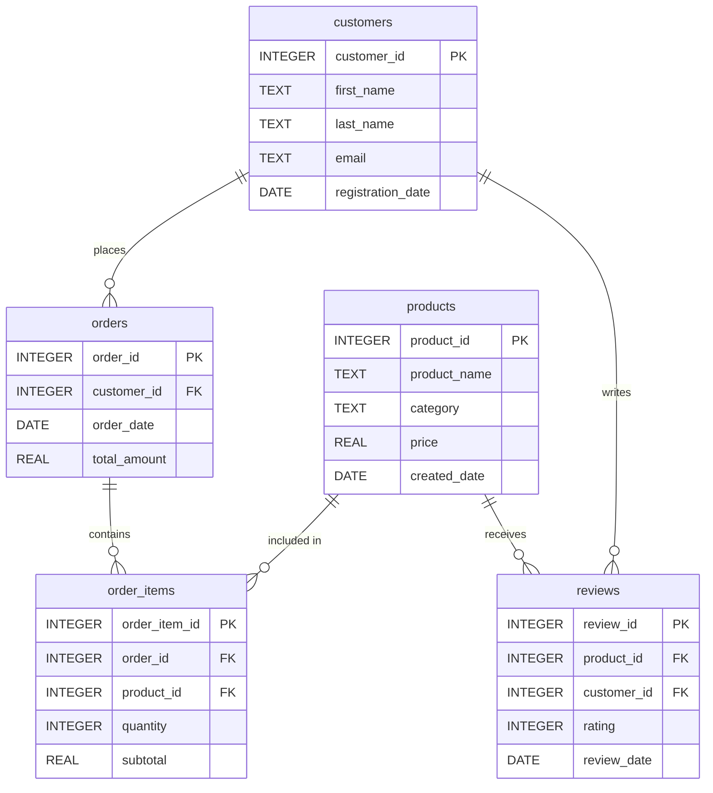

## Project Overview
This project creates a realistic end-to-end e-commerce analytics environment. It generates synthetic transactional data, ingests the data into a SQLite warehouse with enforced relationships, and runs analytical SQL workloads that showcase complex joins and reporting workflows.

## Project Structure
```
ecommerce-database-cursor-ai/
├── .cursorrules
├── README.md
├── analyze_ecommerce.py
├── ecommerce.db
├── generate_ecommerce_data.py
├── ingest_data_to_sqlite.py
├── data/
│   ├── customers.csv
│   ├── order_items.csv
│   ├── orders.csv
│   ├── products.csv
│   └── reviews.csv
└── results/
    ├── category_sales_summary.csv
    ├── complete_order_details.csv
    ├── customer_engagement_metrics.csv
    ├── product_performance_with_reviews.csv
    └── top_customers_by_revenue.csv
```

## Data Schema
Each dataset maps directly to a table in `ecommerce.db`. Primary keys ensure entity integrity, while foreign keys maintain realistic relationships between customers, orders, products, order items, and reviews.



## Setup Instructions
1. **Clone / download** this repository.
2. **Install Python 3.10+** and ensure it is available on your `PATH`.
3. **Create a virtual environment (optional but recommended):**
   ```
   python -m venv .venv
   source .venv/Scripts/activate
   ```
4. **Install required libraries:**
   ```
   pip install pandas faker tabulate
   ```
5. Confirm the `data/` and `results/` directories exist (scripts will create them if missing).

## Usage Guide
- **Generate synthetic data**
  ```
  python generate_ecommerce_data.py
  ```
  Creates five CSV files under `data/` with realistic relationships.

- **Ingest data into SQLite**
  ```
  python ingest_data_to_sqlite.py
  ```
  Drops/recreates the schema in `ecommerce.db`, loads CSVs, enforces keys, and reports row counts.

- **Run analytical queries**
  ```
  python analyze_ecommerce.py
  ```
  Executes five JOIN-heavy analytics, prints formatted tables, and saves each result to `results/`.

## Query Examples
| Query Name | Join Type | Business Purpose |
|------------|-----------|------------------|
| `top_customers_by_revenue` | INNER JOIN | Identify top-spending customers to prioritize loyalty efforts. |
| `product_performance_with_reviews` | LEFT JOIN | Compare sales and sentiment for every product, including those without activity. |
| `complete_order_details` | Multiple INNER JOINs | Inspect recent order lines with customer and product context. |
| `category_sales_summary` | GROUP BY + JOIN | Rank categories by revenue, volume, and average order value. |
| `customer_engagement_metrics` | Mixed JOINs | Score customers on purchases plus review participation to gauge engagement. |

## Sample Results
Example output from `top_customers_by_revenue`:

```
+--------------+----------------------+-----------------------+---------------+----------------+
| customer_id  | customer_name        | email                 | total_orders  | total_revenue  |
+--------------+----------------------+-----------------------+---------------+----------------+
| 542          | Lisa Martin          | lisa.martin@example.com | 12          | 4821.77        |
| 117          | Anthony Jackson      | anthony.jackson@example.com | 11     | 4710.34        |
| ...          | ...                  | ...                   | ...           | ...            |
+--------------+----------------------+-----------------------+---------------+----------------+
```

## Technologies Used
- Python 3.10+
- Faker (data synthesis)
- pandas (data handling + CSV import/export)
- SQLite (embedded relational database)
- tabulate (console formatting)

## Future Enhancements
- Add incremental data refresh workflows.
- Introduce additional sales channels and promotions data.
- Build BI dashboards leveraging the generated datasets.
- Package scripts as CLI tools with argument parsing.

## License
This project is licensed under the MIT License. See the `LICENSE` file or the text below:

```
MIT License

Permission is hereby granted, free of charge, to any person obtaining a copy
of this software and associated documentation files (the "Software"), to deal
in the Software without restriction, including without limitation the rights
to use, copy, modify, merge, publish, distribute, sublicense, and/or sell
copies of the Software, and to permit persons to whom the Software is
furnished to do so, subject to the following conditions:

The above copyright notice and this permission notice shall be included in all
copies or substantial portions of the Software.

THE SOFTWARE IS PROVIDED "AS IS", WITHOUT WARRANTY OF ANY KIND, EXPRESS OR
IMPLIED, INCLUDING BUT NOT LIMITED TO THE WARRANTIES OF MERCHANTABILITY,
FITNESS FOR A PARTICULAR PURPOSE AND NONINFRINGEMENT. IN NO EVENT SHALL THE
AUTHORS OR COPYRIGHT HOLDERS BE LIABLE FOR ANY CLAIM, DAMAGES OR OTHER
LIABILITY, WHETHER IN AN ACTION OF CONTRACT, TORT OR OTHERWISE, ARISING FROM,
OUT OF OR IN CONNECTION WITH THE SOFTWARE OR THE USE OR OTHER DEALINGS IN THE
SOFTWARE.
```

